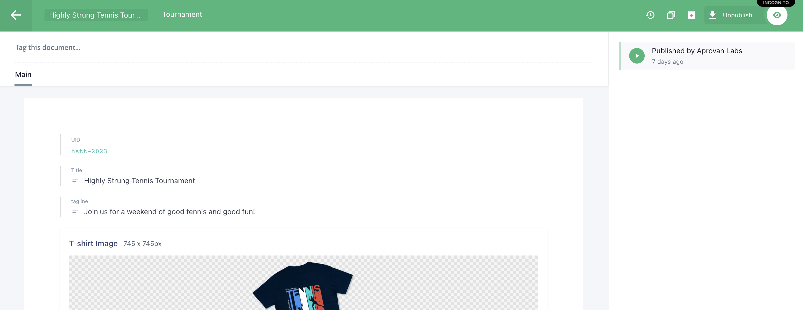

# Prismic Guide for Highly Strung Tennis Tournament Website

## Intro

Prismic allows for you to publish content onto the Highly Strung Tennis Tournament Website without any coding knowledge in an easy & accessible manner. In this tutorial, I will briefly describe some of the basic functions on Prismic and how to access them.

## Accessing Prismic

1. Open your web browser and go to the Prismic website.
2. Sign in to your Prismic account using your credentials (As seen on GitHub).

## Accessing the Repository

1. After logging in, locate and select the "Highly Strung Tennis Website" repository.
2. You will be redirected to the dashboard of your repository.

## Creating and Editing Documents

You will be directed to the 'Documents' page. Documents contain information displayed on the website. For example, the 'Contact Info' document contains the primary email and phone number. THe 'Highly Strung Tennis Tournament 2023' document contains the schedule, FAQ, and images for the tournament.

On the left, you can see the 'Documents' tab selected

1. In the repository dashboard, click on the "Documents" section in the sidebar.
2. Here, you will find the existing documents available for editing.
   - "Highly Strung Tennis Tournament 2023"
   - "Contact Info"
3. To edit a document, click on its name to open it.

## Modifying Document Content

1. Once you open a document, you can modify its content.
2. Update the fields with the relevant information for each document.
   - For "Highly Strung Tennis Tournament 2023," update details such as tournament schedule, FAQ, and images.
   - For "Contact Info," provide the necessary contact details for your the tournament if it is in need of updating.
3. Prismic provides various field types such as text, rich text, date, and image that you can use for the information you want to add or edit.
4. Make sure to save your changes after modifying the content (See [Publishing and Previewing Content](#publishing-and-previewing-content))

## Publishing and Previewing Content

_Unsaved changes (click 'Save' or <kbd>Ctrl</kbd>/<kbd>Cmd</kbd> + <kbd>S</kbd>)_

_Unpublished changes_

1. When you're ready to publish your changes, click on the "Publish" button.
   - Publishing makes your updated content available to the public.
   - You can also use the "Unpublish" option to remove content from the public view temporarily.
2. Prismic offers a preview feature that allows you to see how the content will appear on your website.
   - To preview a document, click on the "Preview" button.
   - Prismic provides a preview link that you can share with others to review the content before publishing.

## Uploading Files and Images

Some of the 'Documents' allow you to upload files and images.

_For example, the "Highly Strung Tennis Tournament 2023" document allows you to upload a file for the submission document_

### Uploading New Files

Click 'Upload media' and select a document or image from your computer.

You'll see a new item appear in the top left of the 'Media library'

### Using Uploaded Files with Documents

Some documents have links/images to select. Click on the 'Select a link' or 'Select an image'

Then, select the document or image you want to use.

Save and publish the document (See [Publishing and Previewing Content](#publishing-and-previewing-content))
